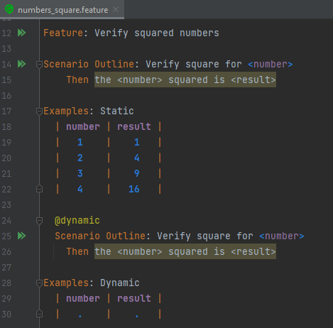
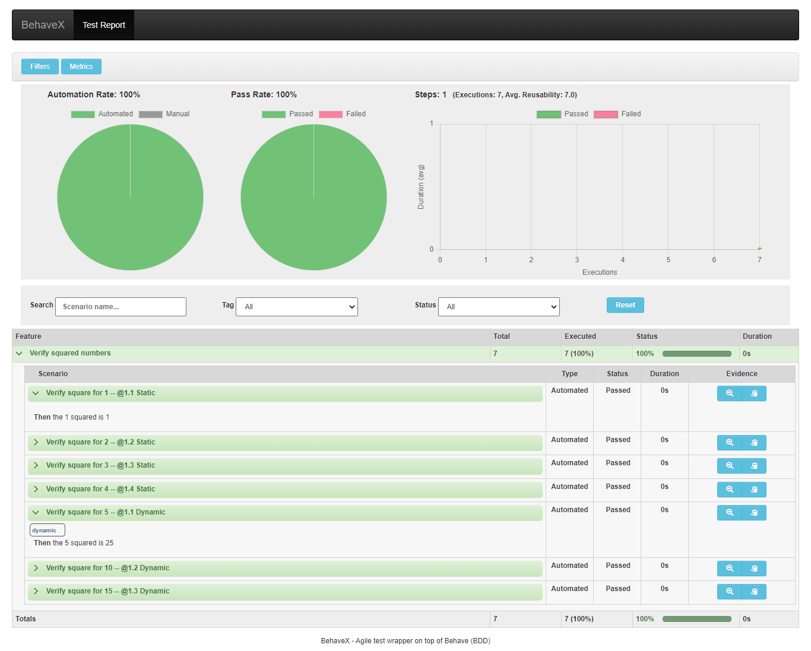

This code can be used to pass dynamic values from commandline to a python behave scenario.

The code is a variant of the code from this [github thread](https://github.com/behave/behave/issues/622) by author [leonardopsantos](https://github.com/leonardopsantos)

You can run it using behave or using behavex to view all the scenarios in a html report

```bash
behave .\features\numbers_square.feature -D input_num="5,10,15"
```

```bash
behavex .\features\numbers_square.feature -D input_num="5,10,15"
```


